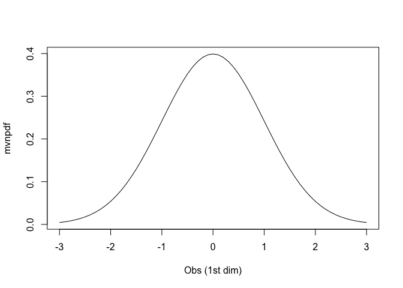

<!-- README.md is generated from README.Rmd. Please edit that file -->

# mypkgr

<!-- badges: start -->
<!-- badges: end -->

The goal of mypkgr is to calculate values of multivariate gaussian
density.

## Installation

You can install the development version of `mypkgr` from
[GitHub](https://github.com/) with:

``` r
# install.packages("devtools")
devtools::install_github("Florian-40/mypkgr")
```

## Example

This is a basic example which shows you how to solve a common problem:

### Univariate density

``` r
library(mypkgr)
mvnpdf(x=matrix(c(1.96,-0.5), ncol=2), Log=FALSE)
#> $x
#>      [,1] [,2]
#> [1,] 1.96 -0.5
#> 
#> $y
#> [1] 0.05844094 0.35206533
#> 
#> attr(,"class")
#> [1] "mvnpdf"
```

### Bivariate density

``` r
mvnpdf(x=matrix(rep(1.96,2),nrow=2, ncol=1),Log=FALSE)
#> $x
#>      [,1]
#> [1,] 1.96
#> [2,] 1.96
#> 
#> $y
#> [1] 0.003415344
#> 
#> attr(,"class")
#> [1] "mvnpdf"
```

### Graphical representation.

``` r
pdfvalues <- mvnpdf(x=matrix(seq(-3,3, by=0.1), nrow=1), Log=FALSE)
plot(pdfvalues)
```


